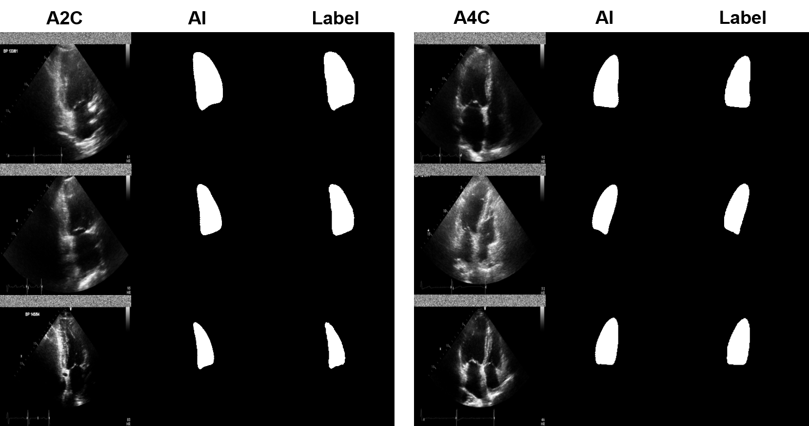

# H.D.A.I 2021 [Won the excellence awards!]
Left ventricle segmentation in A2C/A4C view

<p>   </p>
[Full video](https://www.youtube.com/watch?v=tBeAXEoELEw)

### ResNet CNN
<!-- [model](./Figures/model.png) -->


Input - A2C or A4C

Output - Left ventricle Label map

Loss - DICE & Jaccard & Boundary 

### Evaluation result
<!-- [result1](./Figures/result1.png) -->


<!--[result2](./Figures/result2.png)-->


### Configuration using Anaconda
```python
conda create -n tf python=3.7

conda install tensorflow-gpu=2.1.0 keras-gpu=2.3.1 cudnn cudatoolkit=10.1

pip install matplotlib

pip install sklearn

pip install git+https://www.github.com/keras-team/keras-contrib.git

pip install segmentation-models
```

### How to test 
```python
python run_test.py 
```
Model weight location should be './Model/echocardiography/20211204-112646/models/model_1_epoch_360.hdf5'

Generated files after execution
- ./Data/echocardiography/realLabel : Real label (resized according to the model output size) (.npy)
- ./Data/echocardiography/expectedLabel : Predicted label (resized according to the model output size) (.npy)
- ./Data/echocardiography/comparedLabel : Image of comparison of results (Left : Input image A2C or A4C, Middle : Predicted label, Right: Real label)
- ./Data/echocardiography/evalutaionDSC.txt : Dice Similarity Coefficient of validation/test set
- ./Data/echocardiography/evalutaionJAC.txt : Jaccard indext of validation/test set

### How to train
```python
python run_train.py
```
### How to retrain
```python
python  run_retrain.py
```
### Data
I don't have permission to share data due to security policy of HDAI 2021. 
Please check with https://hdaidatathon.com/


